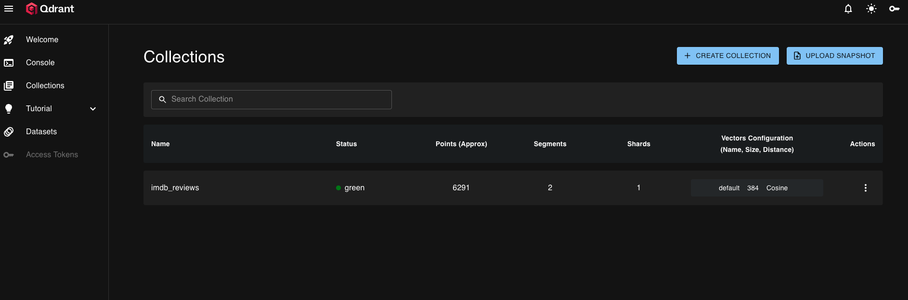
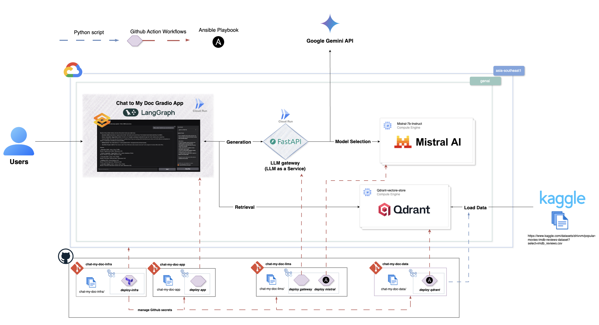

# 🎬 Chat My Doc Data

A data processing pipeline for IMDB movie reviews that extracts, transforms, and loads data into a Qdrant vector database for semantic search and RAG applications.





## ✨ Features

- 📊 **Data Processing**: Load and transform IMDB movie reviews from Google Cloud Storage
- 🧠 **Vector Embeddings**: Generate semantic embeddings using SentenceTransformers
- 🗄️ **Vector Database**: Store and manage documents in Qdrant for similarity search
- ☁️ **Cloud Integration**: Read from and write to Google Cloud Storage
- 🧪 **Testing**: Comprehensive test suite with 79% code coverage

## Architecture



The complete chat-my-doc system consists of four specialized repositories:

- **[chat-my-doc-app](https://github.com/Philippe-Neveux/chat-my-doc-app)**: Gradio-based web application providing an intuitive chat interface for users to interact with AI models and explore IMDB movie reviews through conversational queries.

- **[chat-my-doc-data](https://github.com/Philippe-Neveux/chat-my-doc-data)**: Data processing pipeline that extracts IMDB movie reviews from Kaggle datasets and ingests them into a Qdrant vector database hosted on Google Cloud Engine for efficient similarity search.

- **[chat-my-doc-llms](https://github.com/Philippe-Neveux/chat-my-doc-llms)**: FastAPI-based LLM gateway service that provides unified access to multiple AI models, including Google's Gemini API and a self-hosted Mistral model deployed on Google Cloud Engine.

- **[chat-my-doc-infra](https://github.com/Philippe-Neveux/chat-my-doc-infra)**: Infrastructure as Code (Terraform) repository containing all Google Cloud Platform infrastructure definitions, enabling reproducible and scalable deployment of the entire system.


## 📁 Project Structure

```
.
├── README.md
├── pyproject.toml
├── uv.lock
├── Makefile
├── data/
│   └── standard/
│       └── imdb_reviews.parquet
├── src/
│   ├── chat_my_doc_data/
│   │   ├── __init__.py
│   │   ├── push_doc_to_db.py      # Main data processing and Qdrant integration
│   │   └── raw_data.py            # Raw data utilities
│   ├── ansible_qdrant/            # Qdrant deployment automation
│   │   ├── README.md
│   │   ├── ansible.cfg
│   │   ├── deploy-qdrant.yml
│   │   ├── manage-qdrant.yml
│   │   ├── backup-qdrant.yml
│   │   ├── inventory.yml
│   │   ├── requirements.yml
│   │   └── templates/
│   │       ├── docker-compose.yml.j2
│   │       ├── qdrant-config.yaml.j2
│   │       └── qdrant.service.j2
│   ├── infra/                     # Terraform infrastructure
│   │   ├── README.md
│   │   ├── main.tf
│   │   ├── variables.tf
│   │   ├── outputs.tf
│   │   ├── backend.tf
│   │   └── terraform.tfvars
│   └── notebooks/
│       ├── data_analysis.ipynb       # Data exploration and analysis
│       ├── qdrant_imdb.ipynb
│       └── qdrant_tuto.ipynb
├── tests/
│   ├── __init__.py
│   ├── conftest.py               # Shared test fixtures
│   └── test_push_doc_to_db.py    # Unit tests
└── htmlcov/                      # Coverage reports (generated)
```

## 🚀 Installation

This project uses [uv](https://docs.astral.sh/uv/) for dependency management:

```bash
# Install dependencies
uv sync

# Install with development dependencies
uv sync --group dev
```

## 💻 Usage

### Data Processing Pipeline

Load IMDB reviews, generate embeddings, and upload to Qdrant:

```python
from chat_my_doc_data.push_doc_to_db import main
main()
```

### Individual Components

```python
from chat_my_doc_data.push_doc_to_db import (
    load_reviews_data,
    encode_reviews,
    add_index,
    Qdrant
)
from sentence_transformers import SentenceTransformer

# Load data from GCS
df = load_reviews_data()

# Generate embeddings
encoder = SentenceTransformer("all-MiniLM-L6-v2")
df = encode_reviews(df, "review", encoder)

# Add row indices
df = add_index(df, "id")

# Setup Qdrant and upload
db = Qdrant(url="http://localhost:6333")
db.setup_collection("imdb_reviews", vectors_size=384)
db.upload_documents(
    df,
    vectors_column="vector",
    id_column="id",
    payload_columns=["review_title", "review", "title", "genre"]
)
```

### Data Analysis

Explore the dataset interactively using Jupyter notebooks:

```bash
# Start Jupyter server
uv run jupyter notebook

# Navigate to src/notebooks/data_analysis.ipynb for dataset exploration
```

The `data_analysis.ipynb` notebook provides insights into the IMDB movie reviews dataset, including:
- Dataset structure and statistics
- Movie titles and genres analysis
- Review text exploration

## 🛠️ Development

### Testing

Run the test suite:

```bash
# Run all tests
uv run pytest

# Run with coverage report
uv run pytest --cov=src --cov-report=html --cov-report=term

# Run specific test file
uv run pytest tests/test_push_doc_to_db.py -v
```

### Code Quality

```bash
# Format code
uv run ruff format

# Lint code
uv run ruff check

# Type checking
uv run mypy src/
```

## ⚙️ Configuration

### Google Cloud Storage

The pipeline reads data from GCS by default:
- Reviews file: `gs://rag-open-data/imdb/standard/imdb_reviews.parquet`

### Qdrant Configuration

Default connection: `http://localhost:6333`

For production deployment, see `src/ansible_qdrant/` for automated setup.

## 📦 Dependencies

### Core Dependencies
- `polars` - Fast DataFrame library for data processing
- `qdrant-client` - Vector database client for similarity search
- `sentence-transformers` - Embedding generation for semantic search
- `google-cloud-storage` & `gcsfs` - Google Cloud Storage integration
- `loguru` - Structured logging
- `typer` - CLI framework
- `ansible` - Infrastructure automation and deployment

### Development Dependencies
- `pytest` - Testing framework
- `pytest-cov` - Coverage reporting
- `mypy` - Type checking
- `ruff` - Linting and formatting
- `notebook` - Jupyter notebook support
- `pandas` - Additional data analysis tools

## 🏗️ Infrastructure

### Qdrant Deployment
Automated deployment using Ansible (see `src/ansible_qdrant/`)

### Cloud Infrastructure  
Terraform configurations available in `src/infra/`

## 🤝 Contributing

1. Install development dependencies: `uv sync --group dev`
2. Run tests: `uv run pytest`
3. Ensure code quality: `uv run ruff check && uv run mypy src/`
4. Add tests for new features
5. Update documentation as needed

## 📄 License

[Add your license here]